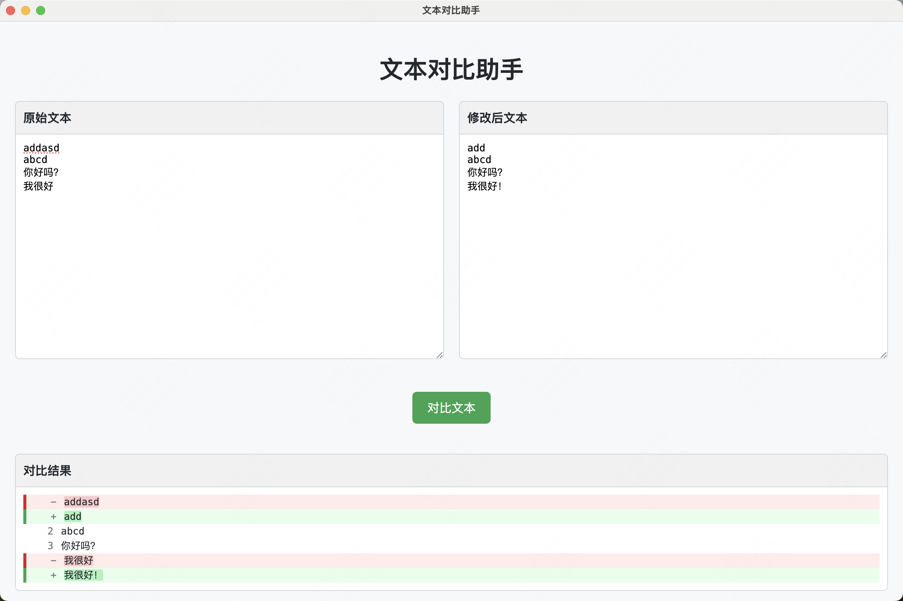

# 文本对比助手

一个简单易用的文本对比工具，帮助您快速发现两段文本之间的差异。类似于GitHub的代码对比功能，使用红色和绿色分别标记删除和添加的内容。



## 功能特点

- 简洁直观的用户界面
- 实时对比两段文本的差异
- 使用颜色标记删除（红色）和添加（绿色）的内容
- 支持多行文本对比
- 跨平台支持（Windows、macOS）
- Windows版为便携式应用，无需安装，双击即可运行

## 使用方法

1. 在左侧文本框中粘贴原始文本
2. 在右侧文本框中粘贴修改后的文本
3. 点击"对比文本"按钮
4. 查看底部结果区域中显示的差异

## 安装方法

### 从源码构建

如果您想从源码构建应用：

1. 克隆仓库
   ```
   git clone https://github.com/yuanyeAjax/text-diff-helper.git
   ```

2. 安装依赖
   ```
   cd text-diff-helper
   npm install
   ```

3. 运行应用
   ```
   npm start
   ```

4. 构建应用
   - Windows版本：`npm run build-win`（生成便携式应用）
   - macOS版本：`npm run build`

   构建完成后，应用将位于`dist`目录中。

## 使用场景

- 对比文档版本差异
- 检查文案修改
- 比较代码片段
- 查找文本更改
- 校对文档内容

## 开发技术

- HTML/CSS/JavaScript
- Electron
- electron-builder

## 其它

为提升性能，将来会用C++重构

## 许可证

ISC
